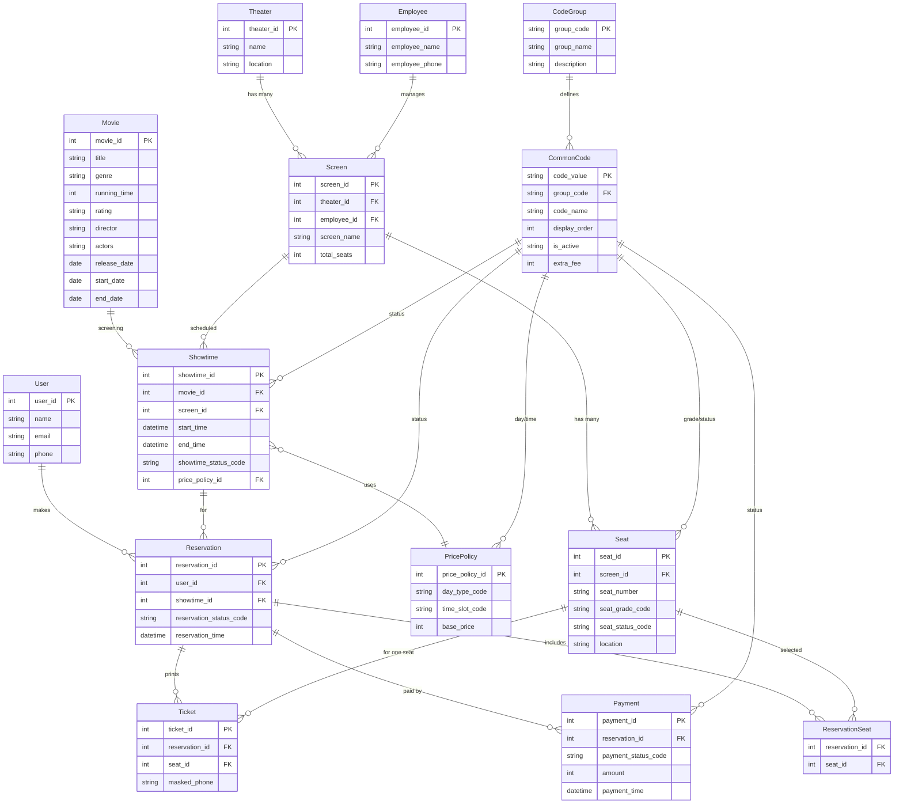

# 최종 ERD
mermaid로 나타낸 erd는 다음과 같습니다.

```mermaid
erDiagram

    %% =========================
    %% Theater (추가)
    %% =========================
    Theater {
        int theater_id PK
        string name
        string location
    }

    %% =========================
    %% Employee (추가)
    %% =========================
    Employee {
        int employee_id PK
        string employee_name
        string employee_phone
    }

    %% =========================
    %% Screen (기존 + theater_id + employee_id 추가)
    %% =========================
    Screen {
        int screen_id PK
        int theater_id FK
        int employee_id FK
        string screen_name
        int total_seats
    }

    Theater ||--o{ Screen : "has many"
    Employee ||--o{ Screen : "manages"

    %% =========================
    %% Seat (기존 + location 추가)
    %% =========================
    Seat {
        int seat_id PK
        int screen_id FK
        string seat_number
        string seat_grade_code
        string seat_status_code
        string location 
    }

    Screen ||--o{ Seat : "has many"

    %% =========================
    %% Movie (기존 구조 유지)
    %% =========================
    Movie {
        int movie_id PK
        string title
        string genre
        int running_time
        string rating
        string director
        string actors
        date release_date
        date start_date
        date end_date
    }

    %% =========================
    %% Showtime (기존 유지)
    %% =========================
    Showtime {
        int showtime_id PK
        int movie_id FK
        int screen_id FK
        datetime start_time
        datetime end_time
        string showtime_status_code
        int price_policy_id FK
    }

    Movie ||--o{ Showtime : "screening"
    Screen ||--o{ Showtime : "scheduled"

    %% =========================
    %% PricePolicy (기존 유지)
    %% =========================
    PricePolicy {
        int price_policy_id PK
        string day_type_code
        string time_slot_code
        int base_price
    }

    Showtime }o--|| PricePolicy : "uses"

    %% =========================
    %% User (기존 유지)
    %% =========================
    User {
        int user_id PK
        string name
        string email
        string phone
    }

    %% =========================
    %% Reservation (기존 유지)
    %% =========================
    Reservation {
        int reservation_id PK
        int user_id FK
        int showtime_id FK
        string reservation_status_code
        datetime reservation_time
    }

    User ||--o{ Reservation : "makes"
    Showtime ||--o{ Reservation : "for"

    %% =========================
    %% ReservationSeat (기존 유지)
    %% =========================
    ReservationSeat {
        int reservation_id FK
        int seat_id FK
    }

    Reservation ||--o{ ReservationSeat : "includes"
    Seat ||--o{ ReservationSeat : "selected"

    %% =========================
    %% Payment (기존 유지)
    %% =========================
    Payment {
        int payment_id PK
        int reservation_id FK
        string payment_status_code
        int amount
        datetime payment_time
    }

    Reservation ||--o{ Payment : "paid by"

    %% =========================
    %% Ticket (과제 요구사항 5번 충족용 추가)
    %% =========================
    Ticket {
        int ticket_id PK
        int reservation_id FK
        int seat_id FK
        string masked_phone
    }

    Reservation ||--o{ Ticket : "prints"
    Seat ||--o{ Ticket : "for one seat"

    %% =========================
    %% CommonCode (기존 유지)
    %% =========================
    CodeGroup {
        string group_code PK
        string group_name
        string description
    }

    CommonCode {
        string code_value PK
        string group_code FK
        string code_name
        int display_order
        string is_active
        int extra_fee
    }

    CodeGroup ||--o{ CommonCode : "defines"
    CommonCode ||--o{ Seat : "grade/status"
    CommonCode ||--o{ Showtime : "status"
    CommonCode ||--o{ Reservation : "status"
    CommonCode ||--o{ Payment : "status"
    CommonCode ||--o{ PricePolicy : "day/time"

```