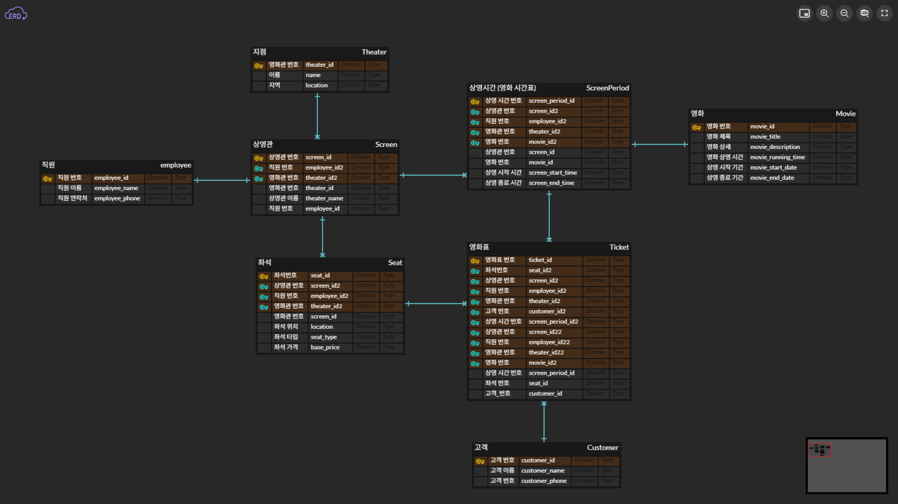

# 1. 과제 개요
## 과제명
DB 모델링 과제 — 영화관 CGB 예약 시스템 설계

## 목표
영화관 CGB의 단일 지점을 기준으로 예약 시스템을 설계하고, 지점 내 여러 상영관 및 영화 상영, 좌석 예매 구조를 데이터 모델로 구현.

## 요구사항
1. **지점**(Theater)은 여러개의 상영관(Screen)으로 이루어져 있다.
2. 상영관은 여러 좌석을 가지고 있다.(**좌석**수는 상영관마다 다를 수 있다. 첫줄 첫번째 자리는 "A1"로 표현)
3. **상영관**은 하루에 여러 상영시간(ScreenPeriod)이 있으며 같은 상영관에서 상영시간은 서로 겹칠 수 없다.
4. 한번의 **상영시간**에 상영되는 영화(Movie)는 하나이다.
5. **티켓**은 고유번호를 가지며 고객의 휴대폰번호가 티켓에 출력되어 있다(휴대폰 번호의 일부는 *로 가린다). 상영관, 상영시간, 좌석도 표시되어야 하며 한 티켓에 한 좌석만 구입가능하다.
6. **영화**(Movie)의 상영기간은 시작일부터 종료일까지. 일단위로 지정. 하나의 영화가 동시에 여러 상영관에서 상영될 수 있다.
7. **좌석**은 위치(Location)와 종류(Type)이 있으며 같은 상영관이어도 위치에 따라 가격이 다를 수 있다.
8. **고객**은 영화상영 10분전까지만 티켓구입이 가능하며. 구입시 상영관과 상영시간. 좌석을 선택하고 핸드폰 번호를 입력해야한다.
9. **상영관**마다 담당자(Employee)가 1명씩 배정된다.
10. **관리자**에게 모든 상영관의 목록과 상영관의 상세정보(좌석의 **예약** 상태 정보)를 제공해야 된다.

# 2. 요구사항 분석
| 요구사항                             | 충족 여부 | 대응 구조                                         |
| -------------------------------- | ----- | --------------------------------------------- |
| 1. 지점은 여러 상영관으로 구성               | ✔     | Theater → Screen                              |
| 2. 상영관은 여러 좌석 보유(A1 형식)          | ✔     | Screen → Seat(seat_number)                    |
| 3. 상영관은 하루 여러 상영시간, 상영시간은 겹치면 안됨 | ✔     | Showtime(ScreenPeriod)                        |
| 4. 한 상영시간에 영화 하나 상영              | ✔     | showtime.movie_id                             |
| 5. 티켓: 한 티켓=한 좌석, 휴대폰번호 마스킹      | ✔     | Ticket(reservation_id, seat_id, masked_phone) |
| 6. 영화 상영기간 존재                    | ✔     | Movie.start_date, end_date                    |
| 7. 좌석 위치/종류별 가격 차이               | ✔     | Seat.location + seat_grade_code + PricePolicy |
| 8. 상영 10분 전까지만 구매 가능             | ✔     | (도메인 규칙 — DB 구조로 충족 가능)                       |
| 9. 상영관마다 담당자(Employee) 1명        | ✔     | Screen.employee_id FK                         |
| 10. 관리자: 상영관/좌석 예약 현황 조회         | ✔     | ReservationSeat + Ticket로 조회 가능               |

# 3. 초기 ERD → 최종 ERD 비교 요약
초기 ERD는 직원/지점/티켓 중심의 단순 구조, 최종 ERD는 예약/가격정책/상태코드까지 포함한 실무형 구조로 발전하였다

## 주요 변화 포인트
 이번 모델링은 초기 과제용 단순 구조에서 출발하여, 도메인 요구사항 분석 및 테이블 역할 정교화를 통해 실무형 구조로 리팩토링되었다.
초기 모델의 단순성을 유지하면서도, 영화관 예약 시스템의 실제 요구사항을 충족할 수 있도록 아래와 같은 변화를 주었다.

**리팩토링 전**


**리팩토링 후**
erDiagram

    %% =========================
    %% Theater (추가)
    %% =========================
    Theater {
        int theater_id PK
        string name
        string location
    }

    %% =========================
    %% Employee (추가)
    %% =========================
    Employee {
        int employee_id PK
        string employee_name
        string employee_phone
    }

    %% =========================
    %% Screen (기존 + theater_id + employee_id 추가)
    %% =========================
    Screen {
        int screen_id PK
        int theater_id FK
        int employee_id FK
        string screen_name
        int total_seats
    }

    Theater ||--o{ Screen : "has many"
    Employee ||--o{ Screen : "manages"

    %% =========================
    %% Seat (기존 + location 추가)
    %% =========================
    Seat {
        int seat_id PK
        int screen_id FK
        string seat_number
        string seat_grade_code
        string seat_status_code
        string location 
    }

    Screen ||--o{ Seat : "has many"

    %% =========================
    %% Movie (기존 구조 유지)
    %% =========================
    Movie {
        int movie_id PK
        string title
        string genre
        int running_time
        string rating
        string director
        string actors
        date release_date
        date start_date
        date end_date
    }

    %% =========================
    %% Showtime (기존 유지)
    %% =========================
    Showtime {
        int showtime_id PK
        int movie_id FK
        int screen_id FK
        datetime start_time
        datetime end_time
        string showtime_status_code
        int price_policy_id FK
    }

    Movie ||--o{ Showtime : "screening"
    Screen ||--o{ Showtime : "scheduled"

    %% =========================
    %% PricePolicy (기존 유지)
    %% =========================
    PricePolicy {
        int price_policy_id PK
        string day_type_code
        string time_slot_code
        int base_price
    }

    Showtime }o--|| PricePolicy : "uses"

    %% =========================
    %% User (기존 유지)
    %% =========================
    User {
        int user_id PK
        string name
        string email
        string phone
    }

    %% =========================
    %% Reservation (기존 유지)
    %% =========================
    Reservation {
        int reservation_id PK
        int user_id FK
        int showtime_id FK
        string reservation_status_code
        datetime reservation_time
    }

    User ||--o{ Reservation : "makes"
    Showtime ||--o{ Reservation : "for"

    %% =========================
    %% ReservationSeat (기존 유지)
    %% =========================
    ReservationSeat {
        int reservation_id FK
        int seat_id FK
    }

    Reservation ||--o{ ReservationSeat : "includes"
    Seat ||--o{ ReservationSeat : "selected"

    %% =========================
    %% Payment (기존 유지)
    %% =========================
    Payment {
        int payment_id PK
        int reservation_id FK
        string payment_status_code
        int amount
        datetime payment_time
    }

    Reservation ||--o{ Payment : "paid by"

    %% =========================
    %% Ticket (과제 요구사항 5번 충족용 추가)
    %% =========================
    Ticket {
        int ticket_id PK
        int reservation_id FK
        int seat_id FK
        string masked_phone
    }

    Reservation ||--o{ Ticket : "prints"
    Seat ||--o{ Ticket : "for one seat"

    %% =========================
    %% CommonCode (기존 유지)
    %% =========================
    CodeGroup {
        string group_code PK
        string group_name
        string description
    }

    CommonCode {
        string code_value PK
        string group_code FK
        string code_name
        int display_order
        string is_active
        int extra_fee
    }

    CodeGroup ||--o{ CommonCode : "defines"
    CommonCode ||--o{ Seat : "grade/status"
    CommonCode ||--o{ Showtime : "status"
    CommonCode ||--o{ Reservation : "status"
    CommonCode ||--o{ Payment : "status"
    CommonCode ||--o{ PricePolicy : "day/time"


### 1) ERD 구조 변화 요약표
   | 구분                              | 기존 ERD (Before)            | 리팩토링 ERD (After)                                 |
   | ------------------------------- | -------------------------- | ------------------------------------------------ |
   | **지점(Thater)**                  | 없음                         | ✔ Theater 테이블 신설                                 |
   | **직원(Employee)**                | 없음                         | ✔ Employee 추가 + Screen에 FK                       |
   | **상영관(Screen)**                 | 기본 Screen만 존재              | Theater/Employee와 연결되고 total_seats 포함            |
   | **좌석(Seat)**                    | seat_number만 존재            | ✔ seat_grade_code, seat_status_code, location 추가 |
   | **좌석 상태**                       | 없음                         | ✔ 공통코드(CommonCode)로 통합 관리                        |
   | **영화(Movie)**                   | 기본 정보만 존재                  | 상영기간(start_date/end_date) 구조 유지                  |
   | **상영시간(ScreenPeriod/Showtime)** | movie_id, screen_id만 단순 연결 | ✔ price_policy_id, status_code 포함한 스케줄 도메인 완성    |
   | **가격정책(PricePolicy)**           | 없음                         | ✔ day_type, time_slot, base_price 정식 도입          |
   | **예약(Reservation)**             | 없음                         | ✔ 예약 테이블 + 예약좌석(ReservationSeat)                 |
   | **결제(Payment)**                 | 없음                         | ✔ Payment 테이블 존재                                 |
   | **티켓(Ticket)**                  | 없음                         | ✔ Ticket(1티켓=1좌석) 추가                             |
   | **공통코드(CodeGroup/Code)**        | 없음                         | ✔ 모든 상태/등급/유형을 코드로 통합                            |
   | **예약 흐름**                       | 구조적으로 구현 불가                | 예약 → 좌석선택 → 결제 → 티켓 발권까지 완성형 플로우                 |
   | **확장성**                         | 낮음                         | 매우 높음 (요금·상태·관리자뷰 확장 가능)                         |

### 2). 기능 흐름 관점 비교표
| 기능            | 리팩토링 전 (사진 ERD) | 리팩토링 후 (최종 ERD)                      |
| ------------- | --------------- | ------------------------------------ |
| **영화 등록**     | 가능              | 동일                                   |
| **상영시간 관리**   | 단순 시간 정보만 존재    | 상태/가격정책 기반 스케줄 관리 가능                 |
| **좌석 표시**     | 좌석 번호 기반 단순 배치  | 등급·위치·상태로 풍부하게 표현                    |
| **좌석 가격 차등**  | base_price만 존재  | PricePolicy + extra_fee로 다양하게 계산 가능  |
| **예약 기능**     | 없음              | 예약 → 좌석 선택 → 결제 플로우 구현               |
| **결제 기능**     | 없음              | Payment 추가로 결제 상태 추적 가능              |
| **티켓 발권**     | 티켓 바로 생성        | 예약+결제 후 Ticket 발급 구조                 |
| **고객 관리**     | 고객 최소 정보        | User 도메인 강화, 예약/결제/티켓과 연동            |
| **스타프/운영관리**  | Employee만 존재    | Employee 유지 + seat/showtime 상태 관리 가능 |
| **상영관 상태 조회** | 정보 부족           | ReservationSeat + Ticket 기반으로 가시화    |
| **운영 확장성**    | 낮음              | 정책/상태 중심으로 실무형 확장 가능                 |

### 3) 테이블 수 비교
| 항목       | 리팩토링 전 (사진 ERD) | 리팩토링 후 (최종 ERD)                |
| -------- | --------------- | ------------------------------ |
| 테이블 수    | 약 8개 수준         | 약 17개 수준                       |
| 가격 정책 관련 | 없음              | PricePolicy + CommonCode       |
| 예약 구조    | 없음              | Reservation + ReservationSeat  |
| 결제 구조    | 없음              | Payment                        |
| 발권 구조    | Ticket만 존재      | Ticket + Reservation 기반        |
| 상태코드 관리  | 없음              | 2개(CodeGroup, CommonCode)      |
| 운영관리     | Employee 존재     | Employee 유지 + Manager 조회 기반 완성 |

## 4) ERD 변화
리팩토링 전 ERD
```text
- 테이블 수 적음(7개)
- 관계 단순 (대부분 1:N 단일방향)
- 상영관-상영시간-좌석-티켓 중심의 단순 흐름
- 상태/가격/예약/결제 같은 비즈니스 로직이 표현되지 않음
- 사용자(User)와 운영자(Admin/Employee) 구분이 모호
```
리팩토릭 후 ERD
```text
- 테이블 수 증가 (약 17개)
- 관계가 실무 프로세스를 그대로 반영 → 상영시간 → 예약 → 좌석 → 결제 → 티켓 발권
- PricePolicy, CommonCode, Reservation 등 “운영·정책·상태” 도메인이 추가되며 구조 풍부
- 확장성 높음
```
